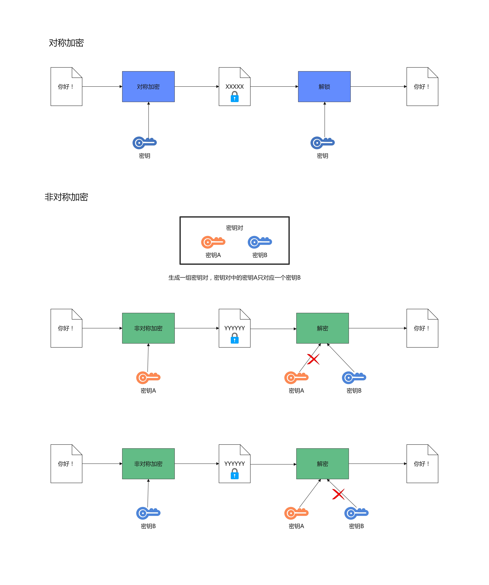
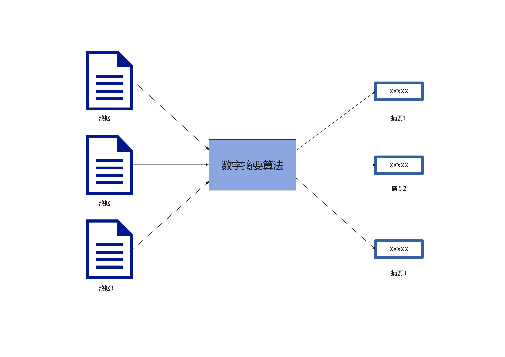
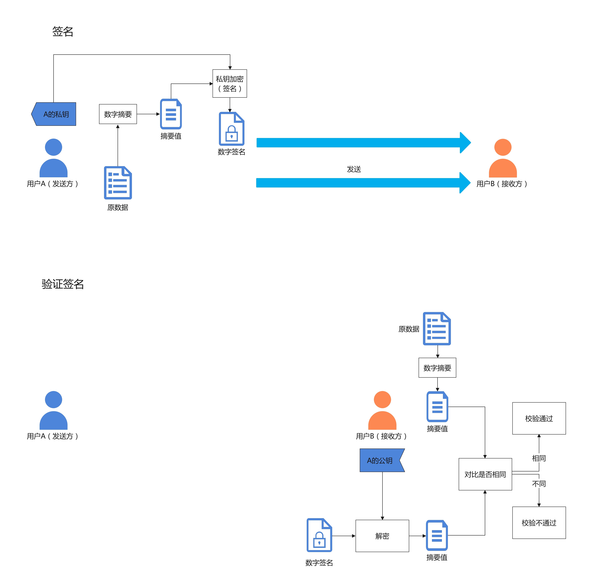

# 介绍

## 概述

本页将采用简短明了的图文来为您介绍本页面的数字签名信息验证的基本原理，阅读完本文章就可以了解为何通过本网站验证的消息是可靠且未篡改的。

## 1. 什么是非对称加密？

要了解数字签名先需要了解何为「非对称加密」。相对于对称加密在加密和解密时使用的是同一个密钥；而非对称加密算法则拥有一对密钥（密钥A、密钥B）来进行加密和解密，当使用密钥A进行加密后只能通过对应的密钥B进行解密，同样地，当使用密钥B进行加密后也只能通过对应的密钥A进行解密，因为加密和解密使用的是两个不同的密钥，所以这种算法叫作「非对称加密算法」。

在实际中，广泛应用的非对称加密算法为RSA算法，使用RSA算法时会先生成一组密钥对，其中一个密钥由拥有者私下保存，称为私钥(private key)；另一个密钥是公开的，称为公钥(public key)。

## 2. 什么是数字摘要？

数字摘要是将**任意长度**的消息变成**固定长度**的短消息，它类似于一个自变量是消息的函数，也就是[Hash函数](https://baike.baidu.com/item/Hash函数/10555888?fromModule=lemma_inlink)。数字摘要是一个**不可逆**的过程，任意数据可以获得其摘要，而无法通过摘要反推出原数据。常见的数据摘要算法有：MD4、MD5、SHA1、SHA224、SHA256、SHA384、SHA52等。

## 3. 什么是数字签名

在了解了「非对称加密」和「数字摘要」后，我们终于可以来聊聊「数字签名」了。

「数字签名」是只有信息的发送者才能产生的别人无法伪造的一段数字串，这段数字串同时也是对信息的发送者发送信息真实性的一个有效证明。它是一种类似写在纸上的普通的物理签名，但是在使用了非对称加密的技术来实现的，用于鉴别数字信息的方法。数字签名是非对称密钥加密技术与数字摘要技术的应用。

当签名者需要对某个数据进行签名时，首先讲该数据进行数字摘要，再使用「**私钥**」对摘要值进行加密，这个被私钥加密后的摘要值就是这一个数据的（数字签名）。在其他人验证签名时，只需将接收到的数据进行摘要，在将签名值用发送者的「**公钥**」解密后与摘要进行对比，这样就可以保证信息的真实性了。

本站采用的签名算法为「SHA256withRSA」，即数字摘要算法采用「SHA256」，非对称加密算法采用「RSA」。

实际情况中，密钥对有一个可靠的第三方机构「电子认证服务机构（又称，CA认证机构，CA，Certificate Authority）」负责颁发，在公钥后附加了用户信息及CA的签名，然后将公钥公之于众，谁都可以使用，谁都可以查询这个公钥是哪个人的。而本站的作用则等同于CA。

[jerryt92.github.io](https://jerryt92.github.io)
